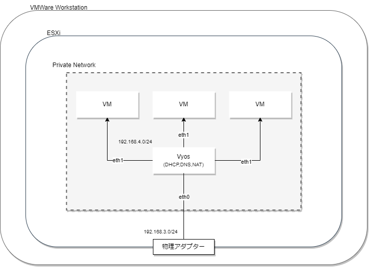

# Vyosを使用してPrivate Network構築

## 構成


# Ansibleで構成管理するまでにやること
## Diskへの書き込み設定
```
install image
```

## ssh serviceの有効化
```
set service ssh
```

## ipアドレスの割り当て
```
set interfaces ethernet eth0 address 192.168.3.254/24
```

# Ansibleの実行
## 実行command
```
ansible-playbook -i ./inventory.ini task/setting.yml --vault-pass ./ansible_vault_pass
```
